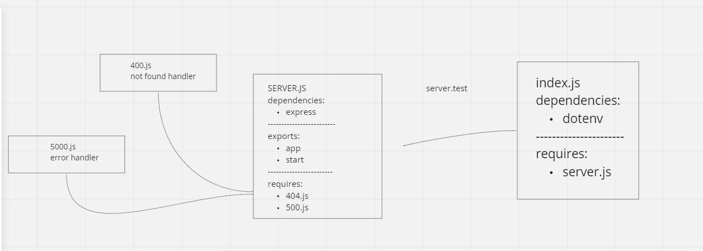

# basic-express-server

Heroku app link:
[https://basic-express-server-amro.herokuapp.com/](https://basic-express-server-amro.herokuapp.com/)

GitHub actions link:
[https://github.com/amroalbarham/basic-express-server/actions](https://github.com/amroalbarham/basic-express-server/actions)

Pull Rrequest link:
[https://github.com/amroalbarham/basic-express-server/pull/1](https://github.com/amroalbarham/basic-express-server/pull/1)

## description

**a basic express server that has a get request an tests that requst along with some middleware. it integrated CI testing and Unit testing.**

## UML 
